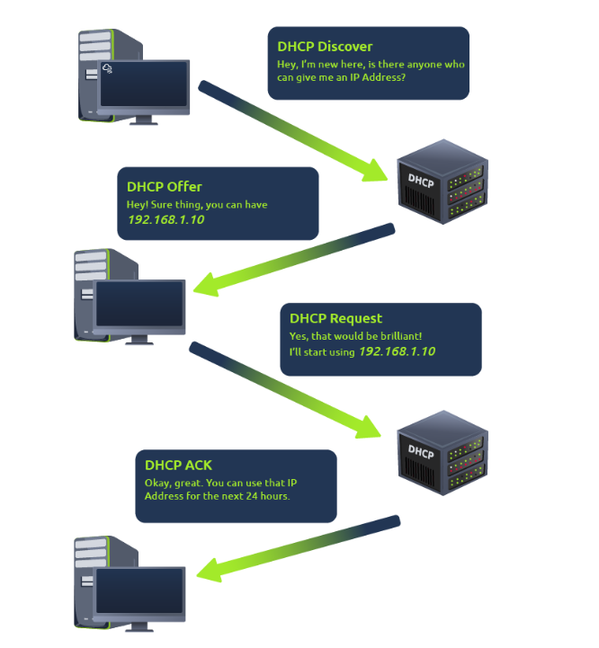

# Summary of IP Address Assignment

## Dynamic Host Configuration Protocol

IP addresses can be assigned manually by entering them into a device or automatically using a DHCP (Dynamic Host Configuration Protocol) server. When a device connects to a network, it requests an IP address from a DHCP server, which responds with an offer. The device confirms the offer, and the server acknowledges, allowing the device to use the IP address.

 • DHCP Discover - Device sents out a request with DHCP Discover to see if any DHCP servers are on the network.
 • DHCP Offer - The DHCP server replies with an IP address the device could use.
 • DHCP Request - Device sends a reply confirming it wants the offered IP Address.
 • DHCP ACK -  The DHCP server replies aknowledging the device can start using the IP address.

