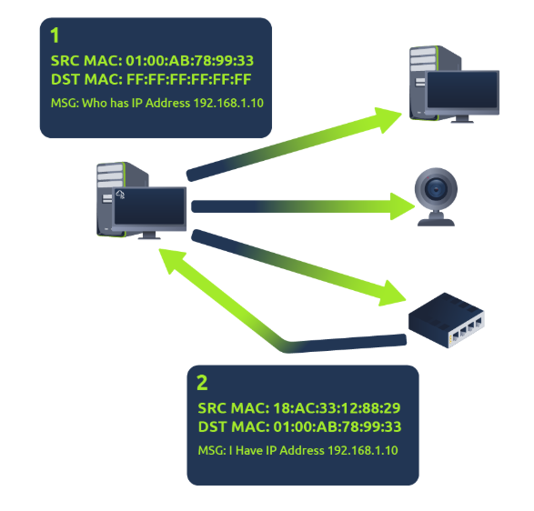

# Understanding Address Resolution Protocol (ARP) 

## Introduction: 
ARP is a protocol that helps devices on a network identify each other using two identifiers: a MAC address and an IP address. 

## Key Points: 

• ARP connects MAC addresses to IP addresses for communication. 

• Devices maintain a log of MAC addresses for other devices in a cache. 

• To communicate, devices broadcast a message to find another device's MAC address. 

• ARP uses two messages: ___*ARP Request and ARP Reply__. 

• An ARP request asks, "What is the MAC address for this IP address? " The concerned device replies with its MAC address. 

• The requesting device saves this information in its ARP cache. 

## Conclusion: 
ARP is essential for device communication within a network by mapping IP addresses to MAC addresses.