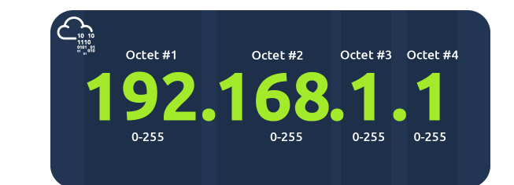

# Understanding Subnetting in Networks 

## Introduction: 
 - Networks vary in size and shape, and subnetting is the process of dividing a larger network into smaller networks. This concept can be likened to sharing a cake, where network administrators decide how to allocate parts of the network. 

## Key Points: 

• Subnetting: Just like slicing cake, it involves splitting a network into smaller sections for better organization. 

• Departments Example: In a business, departments like Accounting, Finance, and Human Resources can be thought of as different subnetworks within the larger network. 

• Subnet Mask: Subnetting defines the number of hosts allowed in a network through a subnet mask, represented by four bytes (32 bits). 

• IP Address Usage: IP addresses serve three functions: 

1. Network Address: Marks the start of the network (e. g. , 192. 168. 1. 0). 
2. Host Address: Identifies devices within the subnet (e. g. , 192. 168. 1. 100). 
3. Default Gateway: Routes data to other networks (e. g. , 192. 168. 1. 254). 

• Application: Homes typically have one subnet, while businesses manage more devices and require subnetting for efficiency and security. 

• Advantages: Benefits of subnetting include enhanced efficiency, improved security, and greater control over network resources. 

 
 
## Conclusion: 
Subnetting is vital in managing networks, separating different user needs, such as employee devices and customer hotspots in a café, while maintaining connections to larger networks like the Internet.