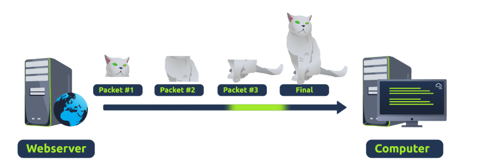
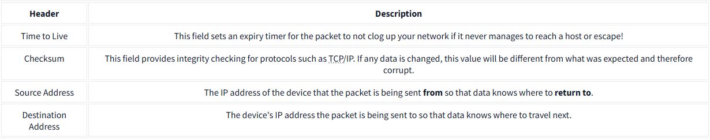

# Understanding Packets and Frames in Networking 

## Introduction 
Packets and frames are essential components in data communication. They are small pieces of data that come together to form larger messages but differ in their roles within the OSI model. 

## Key Points 

• A frame operates at layer 2 (data link layer) and lacks IP address information, likened to an envelope within another envelope. 

• The process of wrapping data in this way is known as encapsulation; packets are associated with IP addresses while frames do not carry this information. 

• Using packets allows for efficient data transmission across networks, reducing bottleneck risks compared to sending large messages. 

• For instance, when loading an image, it is sent in multiple packets and then reconstructed on the user’s computer. 

• Each packet has a unique structure based on its type, following standards that dictate how devices handle them. 

## Some Notable Headers

## Conclusion 
Understanding the differences between packets and frames is crucial for effective data communication in networking.