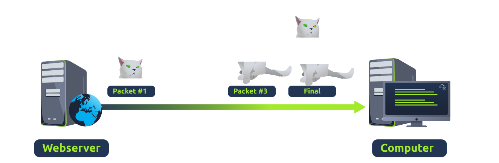

# Layer 4 of the OSI Model: TCP and UDP 

Layer 4 of the OSI model is crucial for data transmission in networks. Data is sent using either TCP or UDP protocols based on specific factors. 

## Transmission Control Protocol (TCP) 
TCP focuses on reliability. It maintains a constant connection between devices during data transfer and includes error checking to ensure data integrity. If a small part of data isn't received, the entire data segment is affected. 

### Advantages of TCP: 
• Guarantees data accuracy. 
• Synchronizes devices to prevent data overload. 

### Disadvantages of TCP: 
• Requires a reliable connection; data cannot be used if one part is missing. 
• Slower due to extra processes for reliability. 

TCP is ideal for file sharing, internet browsing, and email, where complete data is essential. 

## User Datagram Protocol (UDP) 
UDP is simpler and faster than TCP but lacks error checking or delivery guarantees. Data is sent without assurance of receipt, offering flexibility for application developers. 

### Advantages of UDP: 
• Much faster than TCP. 
• Flexibility for controlling packet transmission. 

### Disadvantages of UDP: 
• Unstable connections may lead to poor user experiences. 
• No constant connection means data can be lost. 

UDP works well for small data packets and applications like device discovery or video streaming where some data loss is acceptable.