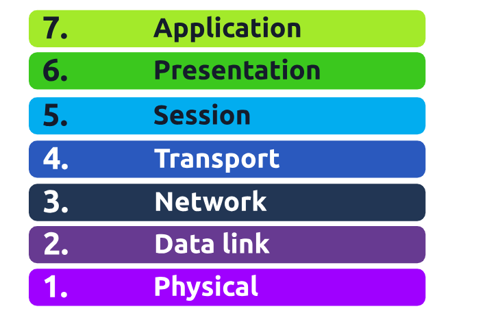

#  Open Systems Interconnection Model

 - Is an essential model used in networking. This framework dictates how all networked devices will send, receive and interpret data.

 There are 7 Layers in the OSI Model:
 