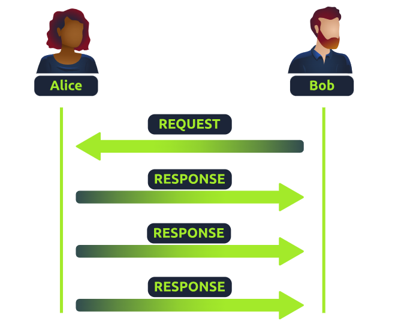
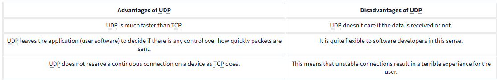
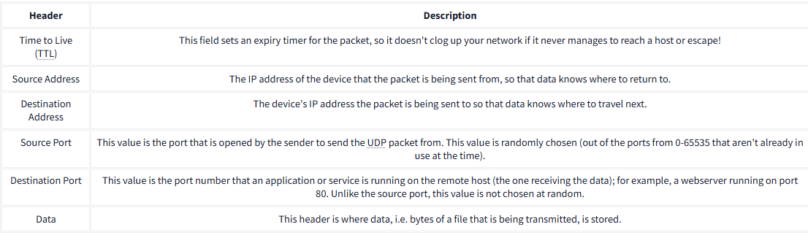

# Overview of User Datagram Protocol (UDP) 

## Introduction: 
The User Datagram Protocol (UDP) is a system used for data communication between devices, distinct from the Transmission Control Protocol (TCP). 

## Key Points: 
• Stateless Nature: UDP does not maintain a constant connection for data transfer, lacking the three-way handshake and synchronization typical of TCP. 
• Use Cases: UDP is chosen for applications that can handle some data loss, like video streaming or voice calls, especially in unstable connections. 

## Advantages and Disadvantages of UDP: 
• Advantages: 
• UDP is faster than TCP. 
• It allows user software to control packet transmission speed. 
• No need for a continuous connection, making it flexible for developers. 

• Disadvantages: 
• There is no guarantee of data receipt; it can lead to a poor user experience on unstable connections. 
• Lacking safeguards for data integrity typical of TCP connections. 

## Header Details: 
UDP packets have simpler headers, which include: 
• Time to Live (TTL): Prevents network congestion. 
• Source Address: IP address of the sender. 
• Destination Address: IP address of the receiver. 
• Source Port &amp; Destination Port: Identify the ports used on sender and receiver devices. 
• Data: Where the transmitted data is stored. 

## Conclusion: 
Understanding how UDP operates and its differences from TCP is essential for selecting the correct protocol for various applications.