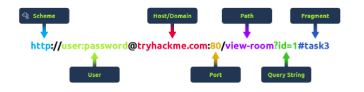
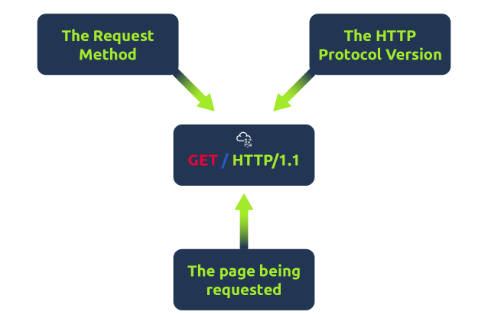

# Understanding URLs and Web Requests 

## Introduction 
When visiting a website, your browser requests resources from a web server. To do this, you must specify how and where to access these resources using URLs. 

## Key Points 

### What is a URL? 
• A URL (Uniform Resource Locator) is an instruction for accessing a resource on the internet. It consists of several parts: 

• Scheme: Protocol used (e. g. , HTTP, HTTPS). 

• User: Username and password for authentication (if needed). 

• Host: Domain name or IP address of the server. 

• Port: Connection port (usually 80 for HTTP and 443 for HTTPS). 

• Path: Location of the resource. 

• Query String: Additional information for the request (e. g. , /blog? id=1). 

• Fragment: References a specific part of the page. 



### Making a Request 
• A basic request can be made with one line: `GET / HTTP/1. 1`. However, for a better experience, additional data called headers is sent. 

Example Request: 
``` 
GET / HTTP/1. 1 
Host: tryhackme.com 
User-Agent: Mozilla/5. 0 Firefox/87. 0 
Referer: https://tryhackme.com/ 
``` 
• This request specifies the method, the website requested, browser information, and the referring page. 

Example Response: 
``` 
HTTP/1. 1 200 OK 
Server: nginx/1. 15. 8 
Date: Fri, 09 Apr 2021 13:34:03 GMT 
Content-Type: text/html 
Content-Length: 98 
``` 

• This response includes the protocol version, status code, server info, date, content type, and length of the response, followed by the requested data. 



## Conclusion 
Understanding URLs and web requests is crucial for navigating and interacting with websites effectively.