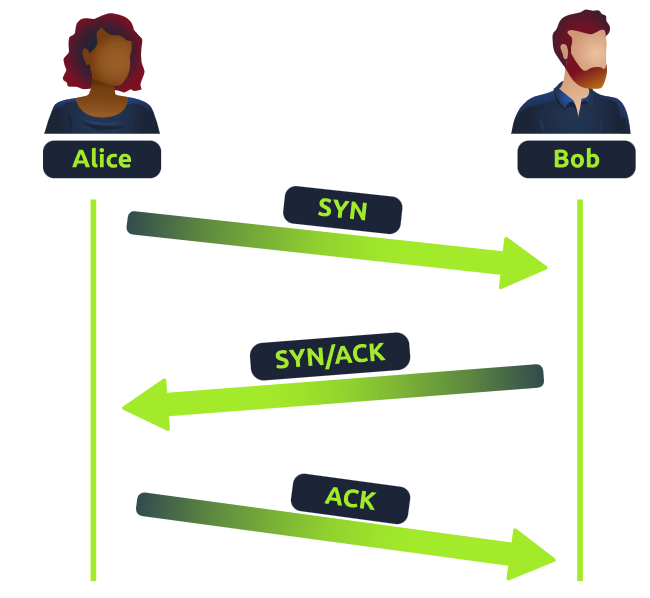
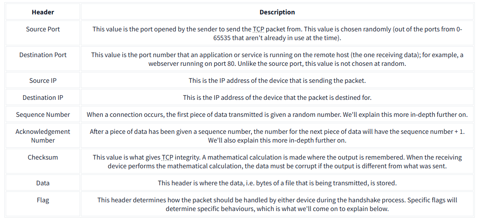
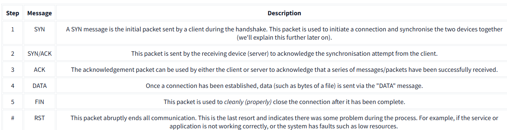
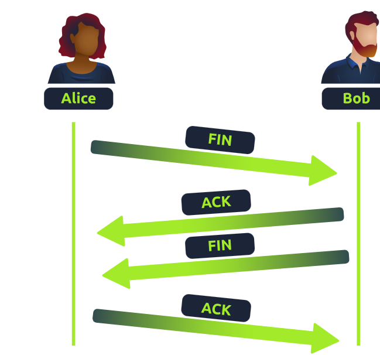
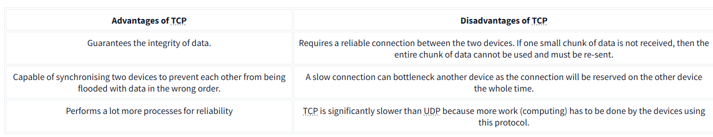

# Overview of TCP (Transmission Control Protocol) 

# Introduction: 
TCP is a key networking protocol that ensures reliable data transmission. 
The three-way handshake is the term given for the process used to establish a connection between two device.

## Key Points: 

• TCP is similar to the OSI model and consists of four layers: Application, Transport, Internet, and Network Interface. 

• Information is added to each layer through a process called encapsulation, which has a reverse process called decapsulation. 

• TCP is connection-based, requiring a connection between client and server before data is sent. 

• It guarantees data receipt through a method called the Three-way handshake. 

• TCP packets contain various sections of information known as headers that are added from encapsulation. Let's explain some of the crucial headers in the table below(from tryhackme):

•The Three-way handshake communicates using a few special messages - the table below highlights the main ones (from tryhackme):

• Closing a TCP connection is started with a "FIN" packet to the other device. Then  the other device needs to "ACK" this packet.

## Conclusion: 
A comparison table of TCP's advantages and disadvantages is provided below.

