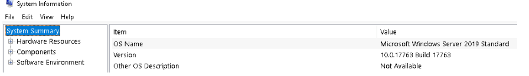
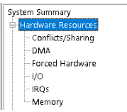
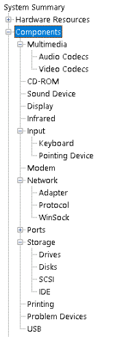
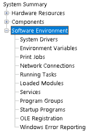
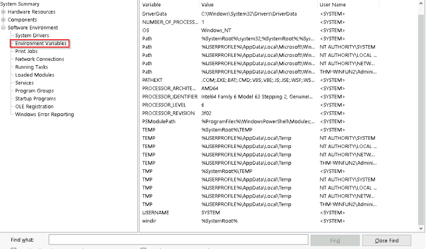
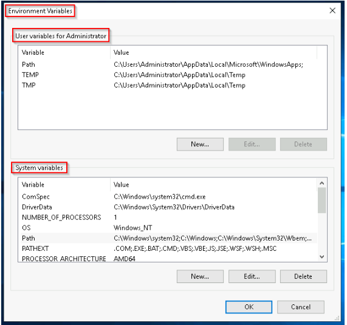
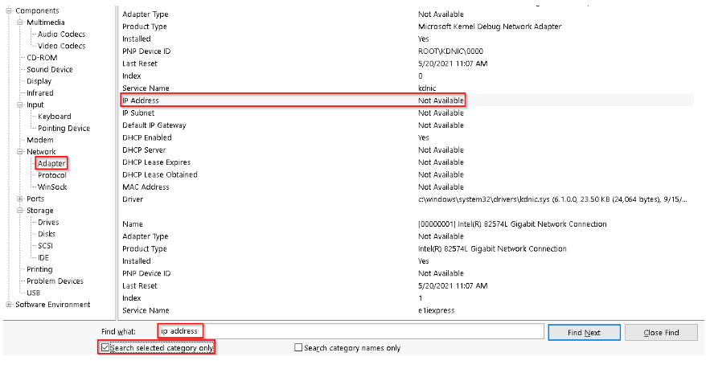

# System Information Tool (msinfo32) 

## Introduction 
This content discusses the Microsoft System Information (msinfo32) tool available through the System Configuration panel, explaining its purpose and the information it provides. 

## Key Points 
• Microsoft System Information (msinfo32. exe) collects details about your computer and presents an overview of hardware, system components, and software. This information can help diagnose computer problems. 

• __The System Summary section includes three categories__: 
1. Hardware Resources - This section is technical and complex, and users should refer to Microsoft's official page for more insights. 

2. Components - Displays specific details about installed hardware like display and 
input devices. 

3. Software Environment - Contains information about built-in and installed software, Environment Variables, and Network Connections. 

• Environment variables hold important information about the operating system, such as the operating system path and locations of folders. The WINDIR variable indicates where Windows files are stored. 

• Users can view environment variables through Control Panel or Settings. 

• To explore msinfo32 further, there is a search feature at the bottom. You are encouraged to select Components and search for "IP address. " 

## Conclusion 
The msinfo32 tool is a vital resource for understanding computer configurations and diagnosing issues.