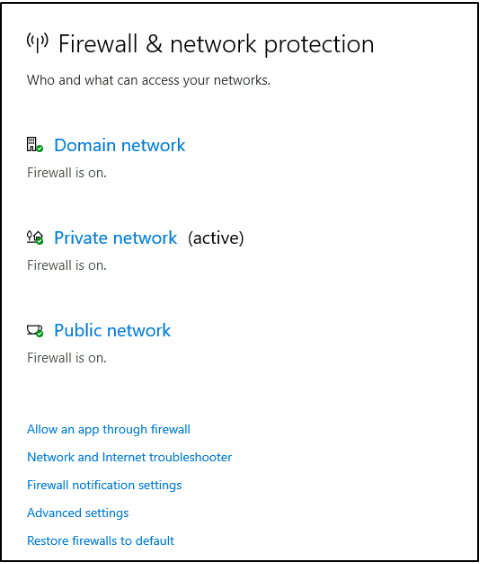
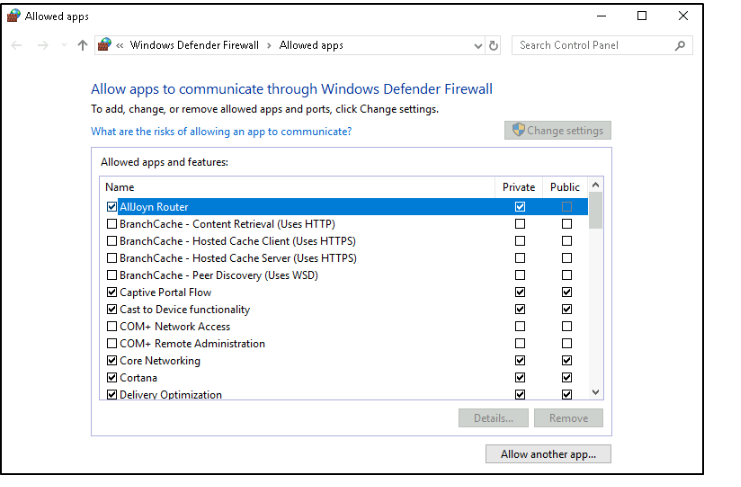

# Firewall And Network Protection

## Firewall

__What is a Firewall?__

A firewall controls the traffic that flows in and out of devices through ports. It acts like a security guard, checking what is allowed to enter or exit. 

__Firewall Profiles__: Domain, Private, and Public 

According to Microsoft, Windows Firewall has three profiles: 

1. Domain: Used when the system can connect to a domain controller. 
2. Private: Assigned by users for home or private networks. 
3. Public: The default setting for public networks like Wi-Fi at cafes or airports. 

When selecting any firewall profile, options to turn the firewall on/off and block all incoming connections will appear. 

__Warning__: Keep Windows Defender Firewall enabled unless you are sure of what you are doing. 

## Allowing Apps Through the Firewall 

You can check the current settings for each profile, and some apps may provide further details. 

## Advanced Settings 

Configuring the firewall is for advanced users; refer to Microsoft documentation for best practices. To open Windows Defender Firewall, use the command WF. msc.