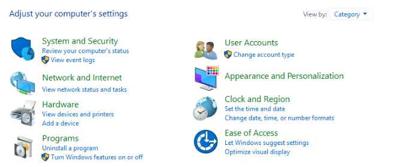
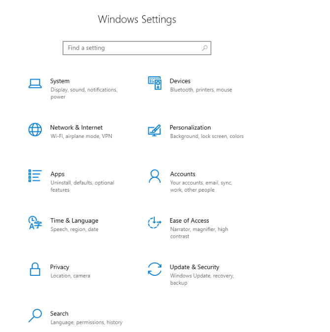
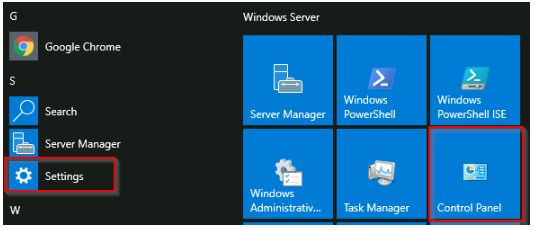

# Windows System Settings Overview 

## Introduction: 
On a Windows system, users can change settings primarily through the Settings menu and the Control Panel. 

## Key Points: 
• The Control Panel has long been used for tasks like adding printers and uninstalling programs. 

• The Settings menu, introduced in Windows 8 for touch screens, is now the main place for system changes in Windows 10. 

• Both menus can be accessed via the Start Menu. 

• The Control Panel offers more complex settings, and users may navigate from Settings to Control Panel for certain tasks. 

• Users can search in the Start Menu to find specific settings easily. 

## Conclusion: 
To answer the question, change the view in the Control Panel to Small icons and check the last setting displayed.