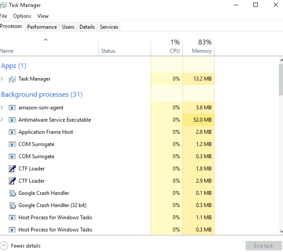

# Task Manager

## Task Manager Overview
 - Provides information about applications and processes running on the system
 - Shows CPU and RAM utilization under Performance

## Accessing Task Manager
 - Right-click the taskbar to open it

## View Options
 - Opens in Simple View initially
 - Click on More details to see additional information

## Additional Resources
 - Refer to a blog post for more detailed information about Task Manager
 - Visit the Core Windows Processes room to learn about core Windows processes and their responsibilities

 