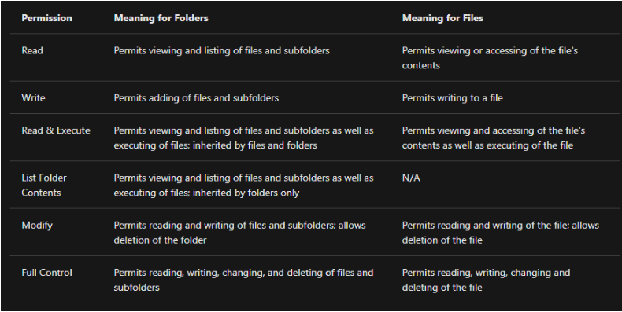

# Understanding the NTFS File System 

## Introduction: 
The New Technology File System (NTFS) is the file system used in modern Windows versions, succeeding older systems like FAT16/FAT32 and HPFS. 

## Key Points: 
• Previous File Systems: Before NTFS, FAT16/FAT32 (File Allocation Tables) and HPFS (High Performance File System) were commonly used. 

• Current Use of FAT: FAT partitions are still seen in devices like USB drives and MicroSD cards, but not usually on Windows computers or servers. 

• Key Features of NTFS: 

• It is a journaling file system that can repair files and folders automatically after a failure using a log file, something FAT cannot do. 

• NTFS supports files larger than 4GB, allows specific permissions on files/folders, provides compression options, and supports encryption (EFS). 

• Checking File System: To find the file system of your Windows installation, check the Properties of the C drive by right-clicking it. 

• Permission Settings in NTFS: NTFS allows users to set permissions such as Full control, Modify, Read &amp; Execute, List folder contents, Read, and Write. 

• To view file or folder permissions, right-click the item, select Properties, and click on the Security tab. 

• Alternate Data Streams (ADS): This is a unique feature of NTFS allowing files to have multiple data streams, although Windows Explorer does not show them. 

• ADS can be used maliciously to hide data but also serves legitimate purposes, such as storing file download identifiers. 
