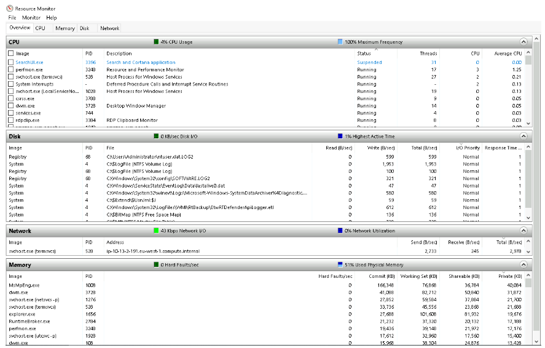

# What is Resource Monitor (resmon)? 

Resource Monitor, as described by Microsoft, is a tool that shows detailed information about CPU, memory, disk, and network usage for individual processes. It allows users to filter data for specific processes, manage services (like starting, stopping, pausing, or resuming), and close unresponsive applications. It also features process analysis to help identify issues like deadlocks and file locking conflicts. 

## Key Points: 
• Resource Monitor is intended for advanced users needing to troubleshoot. 

• It includes four main sections in the Overview tab: CPU, Disk, Network, and Memory. 

• Each section has further information and a right pane displaying real-time graphical data. 

## Conclusion: 
Resource Monitor provides essential insights for computer system management and problem-solving, though the displayed information may vary by user.