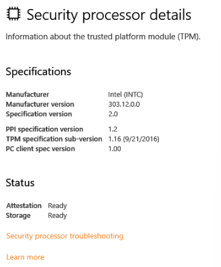

# Trusted Platform Module (TPM)

## What is the Trusted Platform Module (TPM)?

Per Microsoft, "Trusted Platform Module (TPM) technology is designed to provide hardware-based, security-related functions. A TPM chip is a secure crypto-processor that is designed to carry out cryptographic operations. The chip includes multiple physical security mechanisms to make it tamper-resistant, and malicious software is unable to tamper with the security functions of the TPM".

