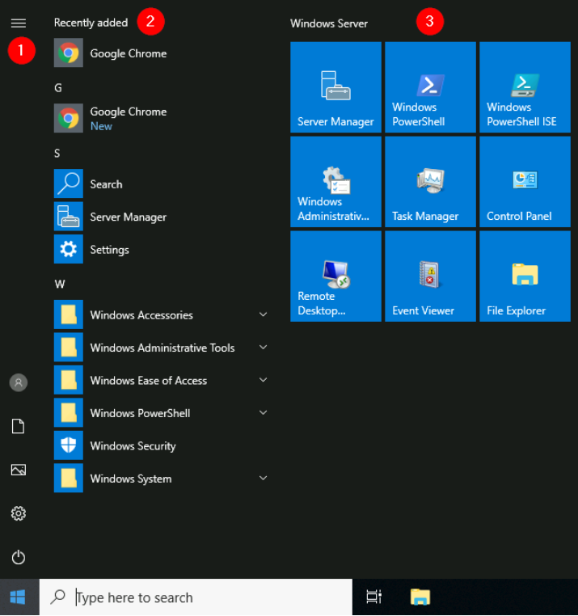
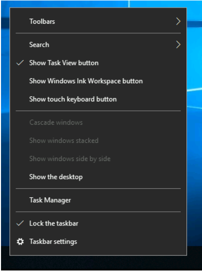

# Summary of Windows 10 Desktop and GUI Components 

## Introduction 
The Windows Desktop, also known as the graphical user interface (GUI), is the main screen you see after logging into a Windows 10 computer. Before accessing the desktop, you must log in by entering your username and password. 

## Key Points 

### The Desktop 
• The desktop contains shortcuts to programs, folders, and files, which can be organized in folders or scattered randomly. 

• You can customize the desktop by right-clicking to access a menu that allows you to change icon sizes, arrangement, and create new items like folders and documents. 

• Display settings let you alter the screen resolution and orientation, especially useful for multiple screens. Note that in a Remote Desktop session, some display settings may be disabled. 

• You can change the desktop wallpaper under the "Personalize" option, which also allows changes to fonts and color schemes. 

1. The Desktop
2. Start Menu
3. Search Box (Cortana)
4. Task View
5. Taskbar
6. ToolBars
7. Notification Area

### The Start Menu 
• The Start Menu can be opened by clicking the Windows logo in the bottom left corner, replacing the previous "Start" label. 

• It provides access to apps, files, and utility tools. 

• The Start Menu is divided into sections: 

1. User account actions and shortcuts, including access to Documents and Pictures folders, Settings, and power options. 
2. Recently added apps appear at the top, followed by a list of installed apps arranged alphabetically. You can jump to specific sections of this list. 
3. The right side contains app tiles, which can be resized or pinned to the Start Menu for quick access. 

### The Taskbar 
• The taskbar shows open apps, folders, and files. You can right-click on it to modify settings. 

• Hovering over an icon provides a preview and tooltip, helping you identify open instances of apps.

• Closed items will disappear from the taskbar unless pinned. 

### The Notification Area 

• The Notification Area, at the bottom right of the screen, shows the date, time, volume icon, and network icon. 

• You can manage which icons appear here through Taskbar settings. 

## Conclusion 
You can customize various aspects of the Windows 10 desktop, including the desktop layout, Start Menu options, taskbar items, and notification icons. By right-clicking on items, you can access additional functions to better organize and manage your workspace.